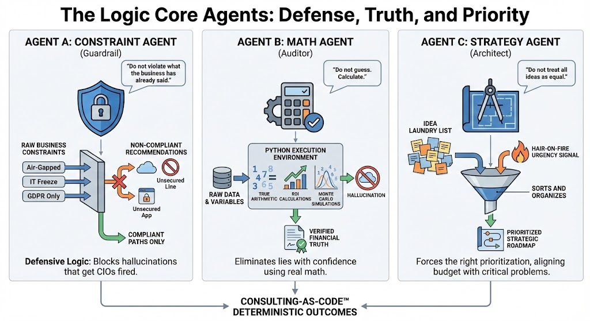

# The Logic Core

The Logic Core is the heart of Consulting-as-Code™.

It replaces the most expensive, error-prone, and politically compromised layer of
traditional consulting: the partner.

This is not augmentation.
This is replacement of function.

---

## What the Logic Core Does

The Logic Core enforces **reality** across all strategic outputs.

It ensures that every recommendation:
- Obeys explicit constraints
- Survives mathematical validation
- Is prioritized against actual urgency and impact

It does not ask for permission.
It does not negotiate.
It does not compromise correctness.

---

## The Three Foundational Agents

### Agent A — The Constraint Agent (The Guardrail)

**Mandate:**  
> “Do not violate what the business has already said.”

This agent enforces:
- Regulatory constraints
- Security boundaries
- Physical limitations
- Budget ceilings
- Explicit technical prohibitions

If the transcript states:
- “We are air-gapped”
- “No cloud”
- “HIPAA only”
- “IT freeze for 18 months”

Then those constraints become **hard blocks**.

Invalid architectures are physically removed from the solution space.

This is why Consulting-as-Code™ does not hallucinate solutions that get CIOs fired.

---

### Agent B — The Math Agent (The Auditor)

**Mandate:**  
> “Do not guess. Calculate.”

This agent performs:
- ROI, NPV, IRR calculations
- Margin-correct financial modeling
- Opportunity cost analysis
- Scenario and sensitivity testing

All math is executed in a real computation environment.
No estimation.
No token prediction.
No rounding by intuition.

If the math does not work, the strategy is rejected.

Confidence without computation is treated as a failure condition.

---

### Agent C — The Strategy Agent (The Architect)

**Mandate:**  
> “Do not treat all ideas as equal.”

Consultants and LLMs produce lists.
Executives need decisions.

This agent:
- Identifies urgency signals
- Detects “hair-on-fire” problems
- Aligns spend with true impact
- Forces prioritization

It refuses:
- Laundry lists
- Generic recommendations
- Over-scoped initiatives

Strategy is not creativity.
It is disciplined exclusion.

---

## Cross-Agent Validation

The agents do not operate independently.

They **challenge each other**.

- If Strategy proposes an initiative → Constraint checks feasibility
- If Strategy proposes value → Math validates economics
- If Math invalidates ROI → Strategy must re-architect
- If Constraint blocks a path → Strategy must find an alternative

This continues until:
- No constraints are violated
- No math is false
- No priorities are misaligned

Only then does an output survive.

---

## The Partner Layer — Automated

Traditional consulting hierarchy:
Analysts → Associates → Managers → Partners

LLMs replace analysts.
Automation replaces associates.
The Logic Core replaces partners.

This is the defining shift.

Consulting-as-Code™ does not automate tasks.
It automates judgment.
